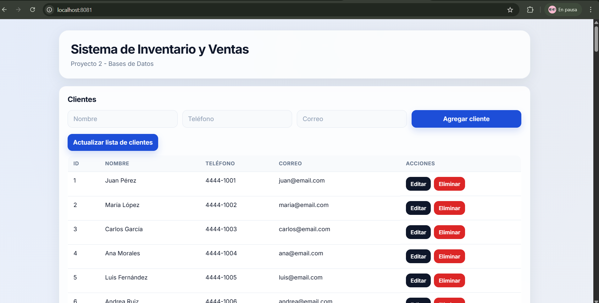
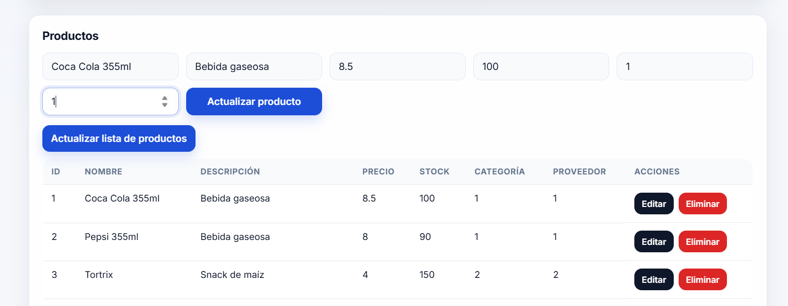
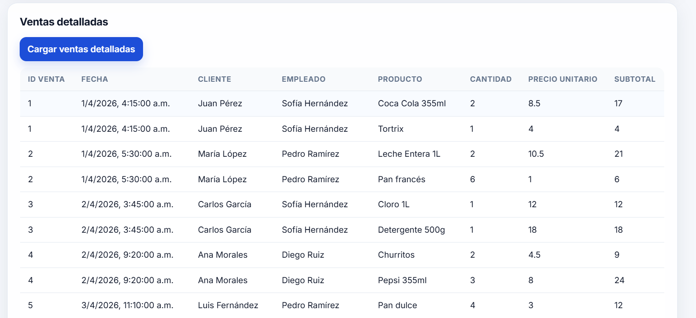

# Proyecto 2 - Sistema de Inventario y Ventas

Proyecto individual del curso **Bases de Datos**.  
Este sistema permite gestionar productos, clientes y ventas de una tienda, utilizando una base de datos relacional en PostgreSQL, un backend en Go y un frontend web simple. Toda la infraestructura del proyecto se levanta con Docker Compose, como lo solicita el enunciado.

## Tecnologías utilizadas

- **PostgreSQL 16**
- **Go**
- **HTML, CSS y JavaScript**
- **Nginx**
- **Docker y Docker Compose**

## Estructura del proyecto

```text
proyecto2-bd/
│
├── backend/
│   ├── Dockerfile
│   ├── go.mod
│   ├── go.sum
│   └── main.go
│
├── frontend/
│   ├── Dockerfile
│   ├── index.html
│   ├── style.css
│   ├── script.js
│   └── nginx.conf
│
├── db/
│   ├── schema.sql
│   ├── seed.sql
│   └── consultas.sql
│
├── .env
├── .env.example
├── docker-compose.yml
└── README.md
```

## Requisitos previos

Antes de ejecutar el proyecto, asegúrate de tener instalado:

- Docker Desktop
- Docker Compose

## Variables de entorno

El proyecto utiliza un archivo `.env` para las credenciales y configuración de la base de datos.  
También se incluye `.env.example` como referencia.

Contenido esperado en `.env`:

```env
POSTGRES_DB=tienda_db
POSTGRES_USER=proy2
POSTGRES_PASSWORD=secret
POSTGRES_PORT=5433
```

## Cómo levantar el proyecto

Desde la raíz del proyecto, ejecutar:

```bash
docker compose up --build
```

Si se desea levantar en segundo plano:

```bash
docker compose up -d --build
```

## Cómo detener el proyecto

```bash
docker compose down
```

Si además se desea borrar el volumen de la base de datos y recrearla desde cero:

```bash
docker compose down -v
```

## Servicios y puertos

Una vez levantado el proyecto, los servicios quedan disponibles en:

- **Frontend:** `http://localhost:8081`
- **Backend:** `http://localhost:8080`
- **PostgreSQL:** puerto `5433`

## Funcionalidades implementadas

### Base de datos
- Diseño relacional basado en un sistema de inventario y ventas
- Tablas con `PRIMARY KEY`, `FOREIGN KEY` y `NOT NULL`
- Datos de prueba con al menos 25 registros por tabla
- Índices definidos explícitamente
- View para ventas detalladas
- Consultas SQL con:
  - JOIN
  - subqueries
  - `GROUP BY`
  - `HAVING`
  - CTE
- Transacciones con `COMMIT` y `ROLLBACK`

### Backend
- API REST en Go
- Conexión a PostgreSQL con SQL explícito
- Endpoints para clientes, productos, ventas y reportes
- Registro de ventas con transacción y actualización de stock
- Soporte CORS para comunicación con el frontend

### Frontend
- Interfaz web para visualizar y gestionar información
- CRUD visual de clientes
- CRUD visual de productos
- Registro de ventas desde la interfaz
- Reporte de productos vendidos
- Vista de ventas detalladas

## Endpoints principales

### Clientes
- `GET /clientes`
- `POST /clientes`
- `PUT /clientes`
- `DELETE /clientes?id={id}`

### Productos
- `GET /productos`
- `POST /productos`
- `PUT /productos`
- `DELETE /productos?id={id}`

### Ventas
- `POST /ventas`
- `GET /ventas-detalladas`

### Reportes
- `GET /reporte/productos`

## Consultas y reportes

El archivo `db/consultas.sql` contiene las consultas relevantes del proyecto, incluyendo:

- 3 consultas con JOIN
- 2 consultas con subquery
- 1 consulta con `GROUP BY`, `HAVING` y funciones de agregación
- 1 consulta con CTE
- uso de una VIEW
- ejemplos de transacciones

## Diseño de base de datos

El sistema fue modelado con las siguientes entidades principales:

- Categoria
- Proveedor
- Cliente
- Empleado
- Producto
- Venta
- DetalleVenta

La tabla `detalle_venta` funciona como entidad asociativa entre `venta` y `producto`, permitiendo registrar múltiples productos por venta y mantener el precio unitario histórico de cada venta.

## Capturas de funcionamiento

### Vista principal del sistema


### Edicion de producto


### Tabla de ventas detalladas



## Consideraciones importantes

- El usuario de base de datos es **proy2**
- La contraseña es **secret**
- El archivo `.env` no debe subirse al repositorio
- Sí debe subirse `.env.example`

## Autor

Proyecto desarrollado por Martin Villatoro para el curso de Bases de Datos.
