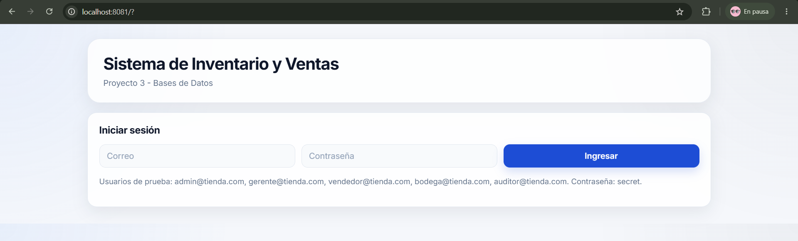
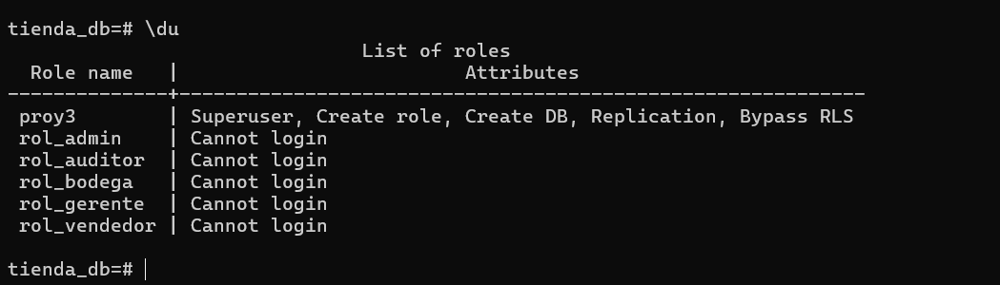
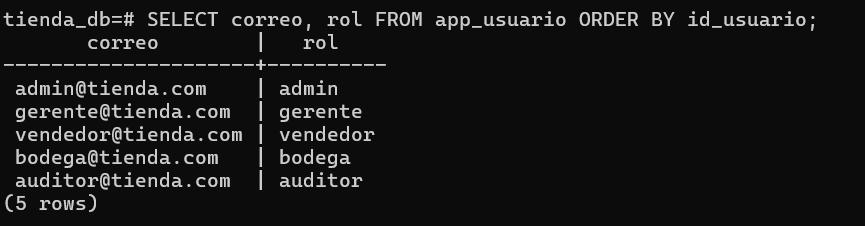
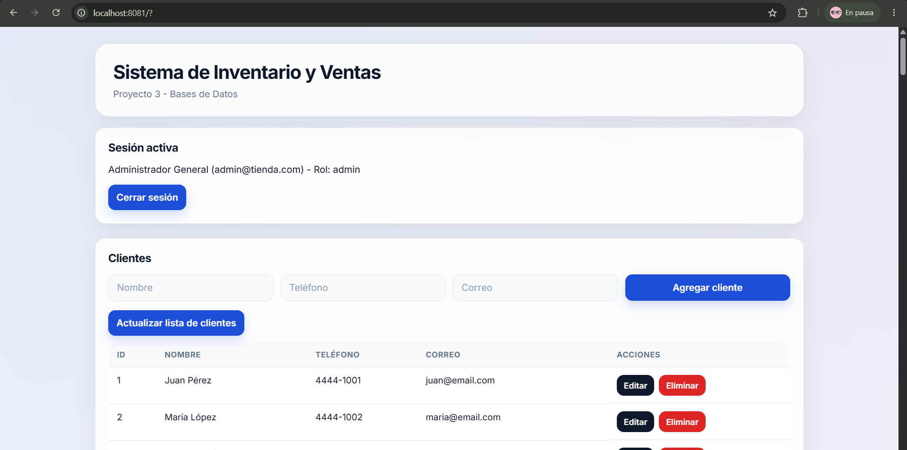
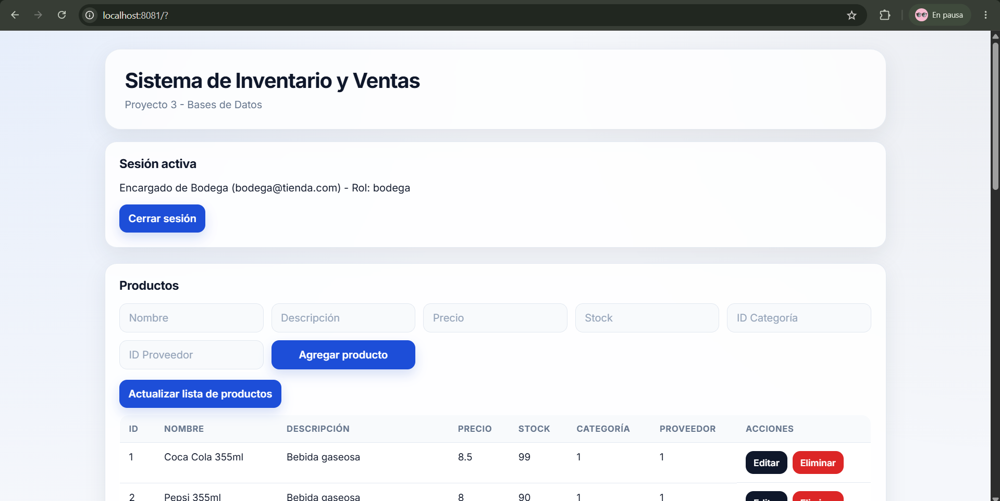
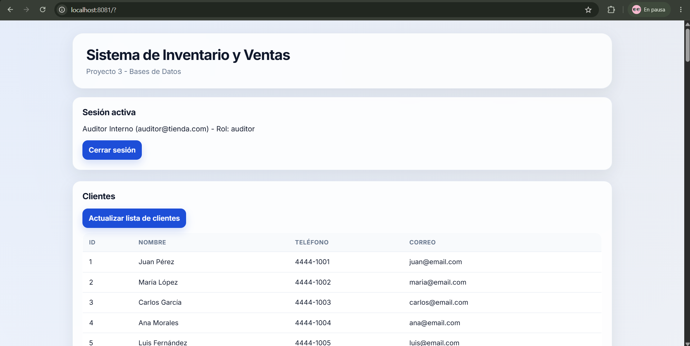
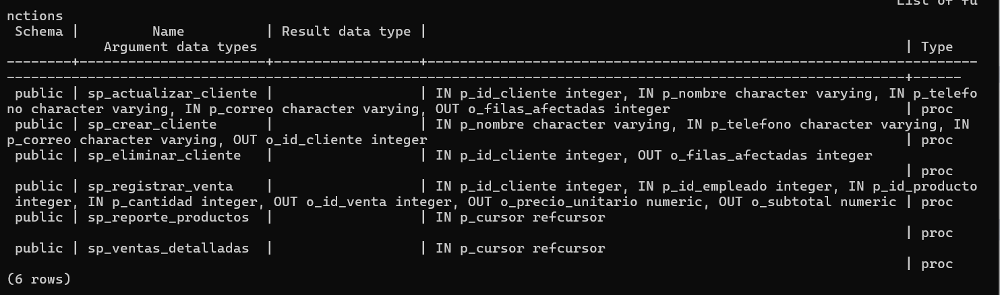

# Proyecto 3 - Bases de Datos 1

## Sistema de Inventario y Ventas con Seguridad, Roles, ORM y Stored Procedures

**Autor:** Martin Villatoro  
**Carné:** 24033  

Este proyecto corresponde al **Proyecto 3** del curso **Bases de Datos 1**.  
Se desarrolló a partir del Proyecto 2, el cual consistía en una aplicación web para la gestión de inventario y ventas de una tienda.

En esta versión se extendió la aplicación para incluir:

- Seguridad con autenticación y sesiones.
- Roles reales definidos en PostgreSQL.
- Permisos por rol.
- Vistas protegidas según el usuario autenticado.
- Uso obligatorio de ORM.
- Stored procedures invocados desde el backend.
- Ejecución completa mediante Docker Compose.

---

## Tecnologías utilizadas

- **Frontend:** HTML, CSS y JavaScript
- **Backend:** Go
- **Base de datos:** PostgreSQL
- **ORM:** GORM
- **Contenedores:** Docker y Docker Compose

---

## Rama de entrega

El proyecto debe ejecutarse desde la rama:

```bash
proyecto-3
```

Para cambiarse a la rama:

```bash
git checkout proyecto-3
```

---

## Levantar el proyecto desde cero

El proyecto está preparado para levantarse completamente con Docker Compose.

Desde la raíz del proyecto, ejecutar:

```bash
docker compose down -v --remove-orphans
docker compose up --build
```

También se puede levantar con:

```bash
docker compose up
```

Al levantar el proyecto desde cero, Docker realiza lo siguiente:

1. Crea la base de datos.
2. Ejecuta los scripts de creación de tablas.
3. Inserta los datos iniciales.
4. Crea los stored procedures.
5. Crea los roles de PostgreSQL.
6. Levanta el backend.
7. Levanta el frontend.

Una vez levantado, la aplicación se puede abrir en:

```txt
http://localhost:8081
```

El backend queda disponible en:

```txt
http://localhost:8080
```

---

## Variables de entorno

Las credenciales utilizadas para la base de datos son las solicitadas para la evaluación:

```env
POSTGRES_DB=tienda_db
POSTGRES_USER=proy3
POSTGRES_PASSWORD=secret
POSTGRES_PORT=5433
```

El archivo `.env.example` incluye estas variables para levantar el proyecto desde cero.

---

## Credenciales de prueba de la aplicación

La aplicación cuenta con un usuario funcional por cada rol del sistema.

| Rol | Correo | Contraseña |
|---|---|---|
| Admin | admin@tienda.com | secret |
| Gerente | gerente@tienda.com | secret |
| Vendedor | vendedor@tienda.com | secret |
| Bodega | bodega@tienda.com | secret |
| Auditor | auditor@tienda.com | secret |

Estas credenciales se incluyen para facilitar la evaluación del proyecto.

---

## Pantalla de login

La aplicación cuenta con una pantalla de inicio de sesión.  
El usuario debe autenticarse antes de acceder a las funcionalidades del sistema.



---

## Roles del sistema

Se definieron exactamente 5 roles de negocio:

1. `rol_admin`
2. `rol_gerente`
3. `rol_vendedor`
4. `rol_bodega`
5. `rol_auditor`

Estos roles fueron creados directamente en PostgreSQL mediante `CREATE ROLE` y se les asignaron permisos utilizando `GRANT` y `REVOKE`.

En PostgreSQL aparecen como roles con `Cannot login`, ya que funcionan como roles de permisos y no como cuentas directas de conexión. La conexión principal a la base de datos se realiza con el usuario `proy3`.

### Evidencia de roles en PostgreSQL



---

## Usuarios por rol

La tabla `app_usuario` contiene un usuario de prueba por cada rol de la aplicación.



---

## Esquema de permisos por rol

| Rol | Permisos principales |
|---|---|
| Admin | Acceso completo a todas las funciones del sistema |
| Gerente | Consulta de clientes, productos, ventas detalladas y reportes |
| Vendedor | Consulta de productos, gestión de clientes y registro de ventas |
| Bodega | Gestión de productos e inventario |
| Auditor | Consulta de información y reportes sin permisos de modificación |

---

## Vistas protegidas por rol

La interfaz cambia según el rol del usuario autenticado.

### Vista como administrador

El administrador puede visualizar todas las secciones principales del sistema.



### Vista como bodega

El usuario de bodega tiene acceso principalmente a la gestión de productos e inventario.



### Vista como auditor

El auditor puede consultar información, pero no tiene formularios de edición o eliminación.



---

## Autenticación y sesiones

El backend implementa autenticación con sesión mediante tokens generados al iniciar sesión.

Endpoints principales de autenticación:

| Método | Ruta | Descripción |
|---|---|---|
| POST | `/login` | Inicia sesión y genera token |
| POST | `/logout` | Cierra la sesión activa |
| GET | `/me` | Devuelve información del usuario autenticado |

Las rutas protegidas requieren enviar el token en el header:

```txt
Authorization: Bearer <token>
```

---

## Rutas protegidas por rol

| Ruta | Método | Roles permitidos |
|---|---|---|
| `/productos` | GET | Admin, gerente, vendedor, bodega, auditor |
| `/productos` | POST | Admin, bodega |
| `/productos` | PUT | Admin, bodega |
| `/productos` | DELETE | Admin, bodega |
| `/clientes` | GET | Admin, gerente, vendedor, auditor |
| `/clientes` | POST | Admin, vendedor |
| `/clientes` | PUT | Admin, vendedor |
| `/clientes` | DELETE | Admin, vendedor |
| `/ventas` | POST | Admin, vendedor |
| `/reporte/productos` | GET | Admin, gerente, auditor |
| `/ventas-detalladas` | GET | Admin, gerente, auditor |

---

## Uso de ORM

Para cumplir con el requisito del Proyecto 3, se configuró y utilizó **GORM** como ORM en el backend.

El ORM se utiliza en el CRUD de productos:

| Operación | Ruta | Implementación |
|---|---|---|
| Listar productos | GET `/productos` | GORM |
| Crear producto | POST `/productos` | GORM |
| Actualizar producto | PUT `/productos` | GORM |
| Eliminar producto | DELETE `/productos` | GORM |

Se mantuvo también el uso de SQL explícito para operaciones avanzadas, reportes y llamadas a stored procedures.

---

## Stored procedures

Se crearon stored procedures en PostgreSQL para manejar operaciones importantes del negocio.

Stored procedures implementados:

| Stored Procedure | Descripción |
|---|---|
| `sp_crear_cliente` | Crea un cliente y retorna su ID |
| `sp_actualizar_cliente` | Actualiza la información de un cliente |
| `sp_eliminar_cliente` | Elimina un cliente |
| `sp_registrar_venta` | Registra una venta, inserta el detalle y descuenta stock |
| `sp_reporte_productos` | Genera reporte de productos vendidos |
| `sp_ventas_detalladas` | Consulta ventas detalladas |

### Evidencia de stored procedures



---

## Stored procedures invocados desde backend

Los stored procedures son llamados directamente desde el backend de Go, no desde scripts independientes.

| Ruta | Stored Procedure usado |
|---|---|
| POST `/clientes` | `sp_crear_cliente` |
| PUT `/clientes` | `sp_actualizar_cliente` |
| DELETE `/clientes` | `sp_eliminar_cliente` |
| POST `/ventas` | `sp_registrar_venta` |
| GET `/reporte/productos` | `sp_reporte_productos` |
| GET `/ventas-detalladas` | `sp_ventas_detalladas` |

---

## Transacción y rollback

El stored procedure más importante es:

```sql
sp_registrar_venta
```

Este procedimiento realiza una operación crítica del negocio:

1. Valida que la cantidad vendida sea mayor a cero.
2. Verifica que el producto exista.
3. Verifica que haya stock suficiente.
4. Inserta la venta.
5. Inserta el detalle de la venta.
6. Descuenta el stock del producto.
7. Confirma la operación con `COMMIT`.
8. Ejecuta `ROLLBACK` si ocurre un error o si el stock es insuficiente.

Con esto se evita registrar ventas incompletas o dejar inconsistencias en el inventario.

---

## Funcionalidades principales

La aplicación permite:

- Iniciar sesión.
- Cerrar sesión.
- Gestionar productos.
- Gestionar clientes.
- Registrar ventas.
- Descontar stock automáticamente.
- Consultar ventas detalladas.
- Consultar reporte de productos vendidos.
- Restringir vistas y rutas según el rol del usuario.

---

## Estructura general del proyecto

```txt
proyecto2-bd/
├── backend/
│   ├── main.go
│   ├── go.mod
│   ├── go.sum
│   └── Dockerfile
├── frontend/
│   ├── index.html
│   ├── script.js
│   ├── style.css
│   ├── nginx.conf
│   └── Dockerfile
├── db/
│   ├── schema.sql
│   ├── seed.sql
│   ├── roles.sql
│   ├── procedures.sql
│   └── consultas.sql
├── assets/
│   └── screenshots/
│       ├── login.png
│       ├── loginadmin.png
│       ├── loginauditor.png
│       ├── loginbodega.png
│       ├── roles.png
│       ├── sp.png
│       └── usuariosxrol.png
├── docker-compose.yml
├── .env.example
└── README.md
```

---

## Verificación en PostgreSQL

Para ingresar a PostgreSQL desde Docker:

```bash
docker compose exec db psql -U proy3 -d tienda_db
```

Para ver los roles creados:

```sql
\du
```

Para ver los stored procedures:

```sql
\df sp_*
```

Para ver los usuarios de prueba:

```sql
SELECT correo, rol FROM app_usuario ORDER BY id_usuario;
```

Para salir:

```sql
\q
```

---

## Pruebas recomendadas

Después de levantar el proyecto, se recomienda probar:

1. Login como administrador.
2. Login como bodega.
3. Login como vendedor.
4. Login como gerente.
5. Login como auditor.
6. Crear, editar y eliminar productos como bodega.
7. Crear, editar y eliminar clientes como vendedor.
8. Registrar una venta como vendedor.
9. Verificar que el stock disminuya después de registrar una venta.
10. Consultar reportes como gerente o auditor.
11. Confirmar que usuarios sin permiso no vean opciones que no les corresponden.

---

## Notas importantes

- El usuario de conexión a la base de datos es `proy3`.
- La contraseña de conexión es `secret`.
- Los roles de PostgreSQL se usan para representar permisos del negocio.
- Los usuarios de la aplicación se encuentran en la tabla `app_usuario`.
- Las credenciales mostradas en el login son únicamente para evaluación académica.
- El proyecto debe evaluarse desde la rama `proyecto-3`.
- El proyecto está preparado para levantarse con `docker compose up`.

---

## Autor

**Martin Villatoro**  
**Carné:** 24033  
**Curso:** Bases de Datos 1
